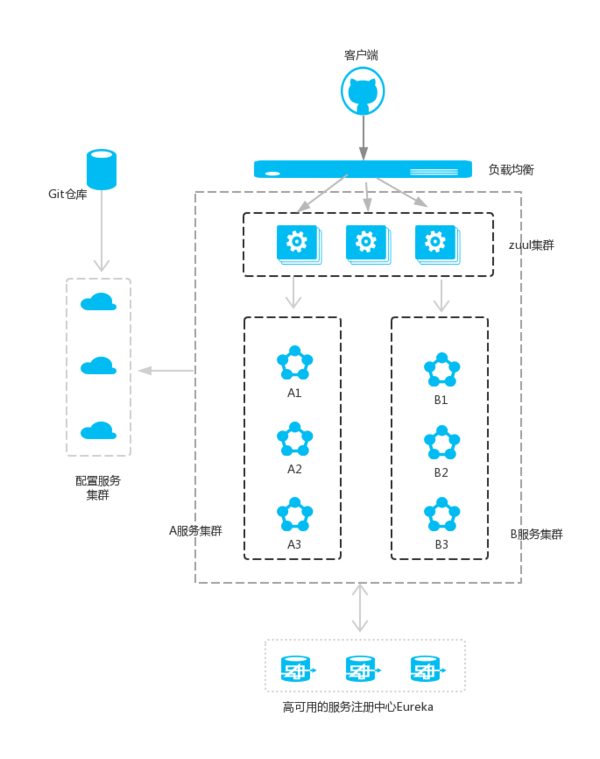
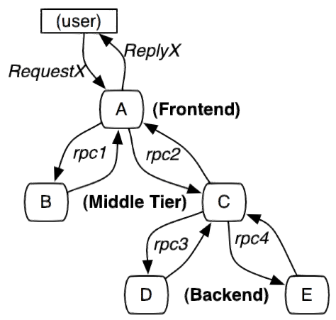
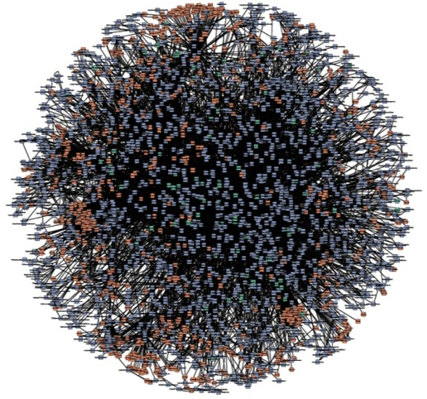
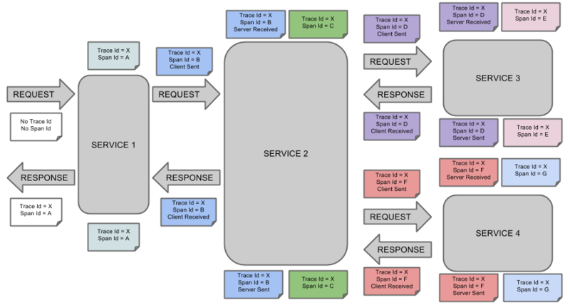

# Spring Cloud

Spring Cloud为开发人员提供了快速构建分布式系统的一些工具，包括配置管理、服务发现、断路器、路由、微代理、事件总线、全局锁、角色竞选、分布式会话等。Spring Cloud提供了强大的工具，可以增强Spring Boot应用的行为来实现这些模式，简要如下：

## Eureka

Eureka是一个服务注册和发现模块。

## Ribbon和Feign

在服务架构中，业务都会被拆分成一个个独立的服务，服务与服务之间的通讯是基于Http RESTful的。Spring Cloud有两种调用方式，一种是Ribbon + RestTemplate，另一种是Feign。Ribbon是一个负载均衡客户端，可以很好的控制Http和Tcp的一些行为。

## Hystric

在微服务架构中，我们将业务拆分成一个个的服务，服务与服务之间可以相互调用（RPC）。为了保证其高可用，单个服务又必须集群部署。由于网络原因或者自身的原因，服务并不能保证服务的100%可用，如果单个服务出现问题，调用这个服务就会出现网络延迟，此时若有大量的网络涌入，会形成任务累计，导致服务瘫痪，甚至导致服务“雪崩”。

为了解决这个问题，就出现断路器模型。Netflix已经提供了一个名为Hystric的库来实现断路器模式。在微服务架构中，多层服务调用是非常常见的。较底层的服务如果出现古战个，会导致连锁故障。当对特定的服务的调用达到一个阈值（Hystric是5秒20次）断路器将会被打开。断路打开后，可用避免连锁故障，fallback方法可以直接返回一个固定值。

## Zuul

在微服务架构中，需要几个关键的组件，服务注册与发现、服务消费、负载均衡、断路器、智能路由、配置管理等，由这几个组件可以组建一个简单的微服务架构，如下图：

客户端的请求首先经过负载均衡（zuul、Ngnix），再到达服务网关（zuul集群），然后再到具体的服务，服务统一注册到高可用的服务注册中心集群，服务的所有的配置文件由配置服务管理（下一篇文章讲述），配置服务的配置文件放在Git仓库，方便开发人员随时改配置。

Zuul的主要功能是**路由和过滤器**。路由功能是微服务的一部分，比如／api/user映射到user服务，/api/shop映射到shop服务。zuul实现了负载均衡。

## Spring Cloud Config

在分布式系统中，Spring Cloud Config 提供一个服务端和客户端去提供可扩展的配置服务。我们可用用配置服务中心区集中的管理所有的服务的各种环境配置文件。配置服务中心采用Git的方式存储配置文件，因此我们很容易部署修改，有助于对环境配置进行版本管理。

## Spring Cloud Bus

Spring Cloud Bus 将分布式的节点和轻量的消息代理连接起来。这可以用于广播配置文件的更改或者其他的管理工作。一个关键的思想就是，消息总线可以为微服务做监控，也可以作为应用程序之间相互通讯。

## Spring Cloud Sleuth

Spring Cloud Sleuth 主要功能就是在分布式系统中提供追踪解决方案，并且兼容支持了zipkin。微服务架构上通过业务来划分服务的，通过REST调用，对外暴露的一个接口，可能需要很多个服务协同才能完成这个接口功能，如果链路上任何一个服务出现问题或者网络超时，都会形成导致接口调用失败。随着业务的不断扩张，服务之间互相调用会越来越复杂。

随着服务的越来越多，对调用链的分析会越来越复杂。它们之间的调用关系也许如下：

- Span：基本工作单元，例如，在一个新建的span中发送一个RPC等同于发送一个回应请求给RPC，span通过一个64位ID唯一标识，trace以另一个64位ID表示，span还有其他数据信息，比如摘要、时间戳事件、关键值注释(tags)、span的ID、以及进度ID(通常是IP地址) 
span在不断的启动和停止，同时记录了时间信息，当你创建了一个span，你必须在未来的某个时刻停止它；
- Trace：一系列spans组成的一个树状结构，例如，如果你正在跑一个分布式大数据工程，你可能需要创建一个trace；
- Annotation：用来及时记录一个事件的存在，一些核心annotations用来定义一个请求的开始和结束。

> cs - Client Sent -客户端发起一个请求，这个annotion描述了这个span的开始；sr - Server Received -服务端获得请求并准备开始处理它，如果将其sr减去cs时间戳便可得到网络延迟；ss - Server Sent -注解表明请求处理的完成(当请求返回客户端)，如果ss减去sr时间戳便可得到服务端需要的处理请求时间；cr - Client Received -表明span的结束，客户端成功接收到服务端的回复，如果cr减去cs时间戳便可得到客户端从服务端获取回复的所有所需时间。

将Span和Trace在一个系统中使用Zipkin注解的过程图形化：

